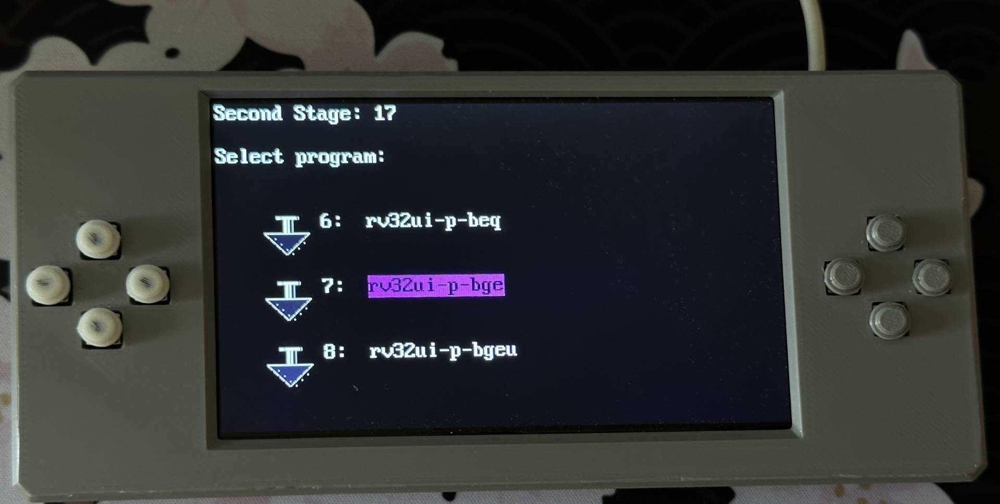

# RISC-Y

## A Custom RISC-V SoC for Gowin FPGA Boards

<center>
  
</center>

RISC-Y is a lightweight, fully open RISC-V system designed for rapid experimentation and education. Targetting the Sipeed Tang Nano 20K board, this project now features enhanced hardware-software integration, a custom bootloader, and multiple tools for application development and debugging.

---

## Features

- **RV32I Core with Extensions:**  
  Fully implements the RV32I instruction set with the Zicsr privileged extension and plans to add multiplication, division, and floating-point support.
- **Integrated Peripherals:**  
  Support 40-pin LVDS displays, SDRAM controller,SPI Flash storage, and a programmable bootloader.
- **On-Board Software Tools:**  
  Includes a GCC-based toolchain, a Python-based Program Merger for ROM filesystem, and an RV32I emulator acting as a golden model for verification.
- **Custom Bootloader & File System:**  
  A lightweight bootloader that reads an integrated flash binary file system, allowing users to select and load applications directly into the FPGA’s RAM.
- **Testbench and Debugging:**  
  Built-in testbench support for verifying assembly and C-code execution, along with a simulation environment that mimics the VGA text mode output and real-time register monitoring.
- **Extensible Design:**  
  Designed with future enhancements in mind – including DRAM controllers, performance monitors, virtual memory, and even multicore expansion.
---

## Prerequisites & Setup

### Hardware Requirements

- **FPGA Boards:**  
  Tang Nano 9K, Tang Nano 20K, or Tang Primer 25K (note: Primer 25K requires careful connection of HDMI PMOD and proper button/keyboard interface wiring).
- **Programming Cable & Drivers:**  
  Ensure your board is properly connected via USB. For Windows users, if programming errors occur, use [Zadig](https://zadig.akeo.ie/) to replace the drivers for “USB Debugger 0” and “USB Debugger 1” with WinUSB.

### Software Requirements

- **Gowin IDE (v1.9.11 -- v1.9.12 is buggy and does not work):**  
  Download from [Gowin’s website](https://www.gowinsemi.com/en/support/download_eda/).  
  - **Windows:** Install the Floating Point license from Sipeed if using a non-educational version.  
  - **Linux:** Extract the downloaded package and run the install.sh script located in the `Gowin/Drivers` directory.  
  - **Mac:** Download the mac version (under the Linux tab) and follow the available tutorial (e.g., via Reddit posts).
- **riscv64-unknown-elf-gcc Toolchain:**  
  - **Linux:**  
    ```bash
    sudo apt update
    sudo apt install gcc-riscv64-unknown-elf
    export PATH=/opt/riscv/bin:$PATH
    source ~/.bashrc
    riscv64-unknown-elf-gcc --version
    ```  
  - **Mac:**  
    Install Homebrew then:  
    ```bash
    brew tap riscv-software-src/riscv
    brew install riscv-tools
    riscv64-unknown-elf-gcc --version
    ```

---

## Installation & Bitstream Generation

1. **Download & Install Gowin IDE:**  
   Install the IDE and required drivers following the instructions above.

2. **Generating the Bitstream:**  
   - Launch the Gowin IDE (either from the Applications folder or via `Gowin/Gowin_1.x.x/IDE/bin/gw_ide`).
   - Open the project file (*.grpj) corresponding to your FPGA board (e.g., Tang Primer 25K).
   - Run synthesis and Place & Route by double-clicking the corresponding buttons in the process window.
   - Open the programmer window and, if programming to flash, select “Gowin External Flash Mode” (for temporary SRAM testing, leave in SRAM Mode).  
     > **Note for Tang Primer 25K:** Due to a known bug, if using flash you may need to use the generated output.fs file.

3. **Burning Program Files to Flash:**  
   - Build your application (see below) so that an .ELF file (e.g. `build0/program.elf`) is generated.
   - Navigate to the `riscYcompiler/MergerV2/` directory and run:
     ```bash
     python3 merger.py
     ```
   - Drag and drop your binary (and optionally a 16×16 thumbnail image) onto the GUI and press “Merge.” This creates a merged_programs.bin file.
   - In the Gowin programmer, update the start address to 0x500000 (if using Tang Nano20k or Tang Primer 25K) and point to the merged binary file. Then flash the bitstream.

---

## Software Development

### Building an Application

- Navigate to `riscYcompiler/riscYcompiler/` and open your project in your favorite editor.
- Edit the main application file (e.g. replace `main.cpp` with code from `WorkingCodes/helloWorldNew.c` for testing).
- Run `make` to compile your application. The resulting binary will appear in a `builds/` folder.
- Use the Program Merger as described above to incorporate your application into the bootloader file system.

### Bootloader Modifications

- The bootloader (located in `riscYcompiler/bootloaderCompiler/`) is the first code executed on FPGA reset. It's main purpose is to copy the second stage bootloader's binary to the BRAMS (16KB). The memory size of this code is 2KB and is rather small.  
- To update the bootloader:
  - Edit `main.c` in the bootloader folder.
  - Rebuild the bootloader and copy the generated hex code (from builds/buildX/program.hex) into the “text.hex” field in GowinEDA.
  - Re-run Place & Route and re-flash the bitstream.
  
### Second Stage Bootloader / Program selecting Modifications

- The bootloader (located in `riscYcompiler/secondStageCompiler/`) is the second code part of the booting process. It's used to display a program selection to the user and check the correctness of the SDRAM (writes to all the places in RAM and reads it back).  
- To update the bootloader:
  - Edit `main.c` in the bootloader folder.
  - Rebuild the bootloader and flash the program.bin that got produced at the 0x750000 memory region.
  <center>
  
</center>

### Testbench & Debugging

- For simulation, copy your compiled assembly hex file into `includes/testbenchtext.hex`.
- Run the provided testbench script:
  - **Linux/macOS:** `./Testbench/runTB.bash`
  - **Windows:** `testbench.bat`
- The testbench outputs debug information and generates a VCD file and can be opened either with GTKWAVE or preferably Surfer.

---

## Additional Tools & Resources

- **Program Merger:**  
  A Python GUI that streamlines merging multiple binaries (and optional thumbnails) into a single flash image.
- **RV32I Emulator:**  
  A Rust emulator for verifying code before deploying to FPGA.
- **Documentation:**  
  For in-depth architectural details, interrupt handling, cache implementation, and peripheral design, please refer to the full project documentation.

---

## Future Enhancements


- **✓ DRAM Controller & SDRAM Support:** Expand memory capabilities.
- **Enhanced CPU Performance:** Add branch prediction, performance monitors, and (far fetched) out-of-order execution.
- **✓ Operating System Integration:** Port a lightweight RTOS (e.g., Zephyr) to support multitasking.
- **Peripheral Expansion:** Develop additional controllers (SD card, I2C, GPIO) and explore multicore configurations.
- **Data cache:** Expand memory capabilities.

---

## Acknowledgments

Developed at the **University of Thessaly**.  
Special thanks to the contributors, the riscv toolchain, and the open-source community for providing invaluable resources and support. Further thanks to Nand2Mario for providing information on the numerous peripherals of the boards.

---

## Contributing

Contributions are welcome! If you have ideas, bug fixes, or enhancements, please open an issue or submit a pull request.

---

*For any questions or support, please open an issue in this repository.*
