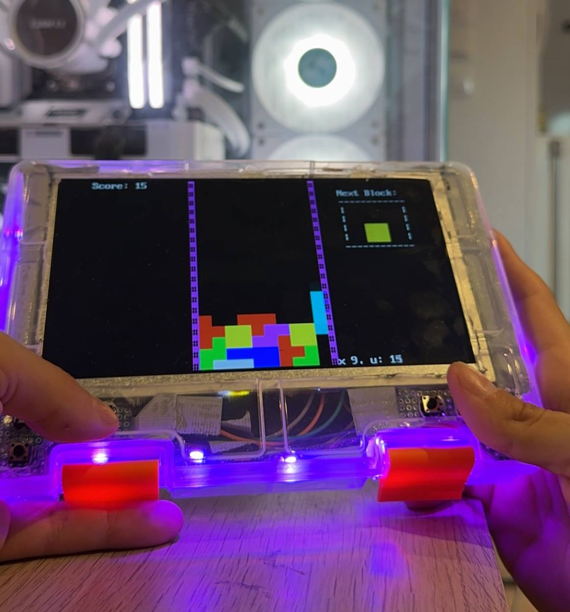
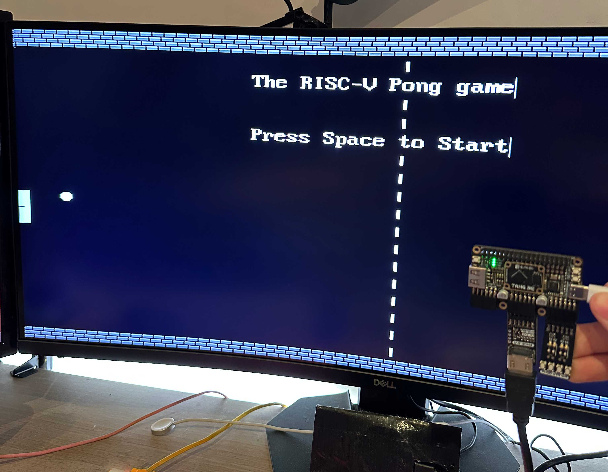
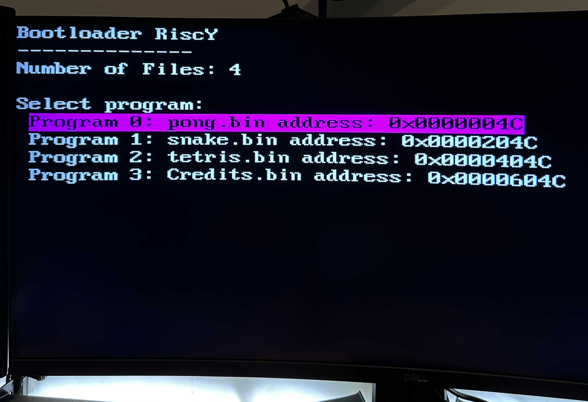

# RISC-Y

## A RISC-V System implementation for the Gowin FPGA Tang Nano 9k and Primer 25k.

    

## Features

- **Fully implemented RV32I instruction set**
- **Ziscr extension** (under development)
- **HDMI and 40-pin LVDS display interfaces**
- **USB keyboard interface** with a softcore microcontroller
- **GCC Compiler and Scripts** utilized for writing code and compiling it for our system
- **Simple startup and program selector** that loads programs from flash memory

## Installation Instructions

### Prerequisites

- **Gowin IDE** version **1.9.10** or higher
- **openFPGALoader**

### Steps

1. **Flash the Bitstream**:
   - Use the Gowin IDE to program the FPGA with the provided bitstream for either the Tang Nano 9k or Primer 25k.
2. **Burn Program Files to Flash**:
   - Utilize the `merger.py` script to merge your program files.
   - Burn the merged program files to the flash memory.

## Usage

- **Startup**:
  - Power on the FPGA board; the system will initiate the simple startup program.
- **Program Selector**:
  - Choose from multiple programs stored in flash using the program selector interface.
- **Interfaces**:
  - **Display Output**: Connect via HDMI or the 40-pin LVDS display.
  - **Input Devices**: Use a USB keyboard through the softcore microcontroller interface.

## Documentation

You can also see the documentation of our project [(https://nanousis.com/riscY/documentation/)](https://nanousis.com/riscY/documentation/)

## Dependencies

- **Gowin IDE** (version 1.9.10 or higher): [Download Here](https://www.gowinsemi.com/en/download/)
- **openFPGALoader**: [GitHub Repository](https://github.com/trabucayre/openFPGALoader)

## Showcase 

    
    

## Acknowledgments

Developed at the **University of Thessaly**.

## Contributing

Contributions are welcome! Feel free to open an issue or submit a pull request.

---

*For any questions or support, please open an issue in this repository.*
